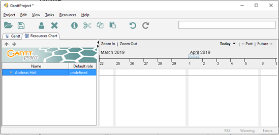
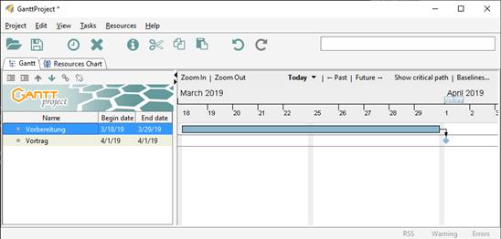
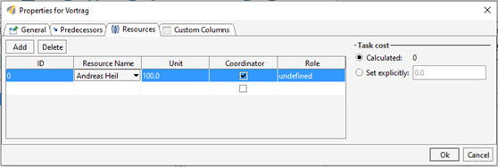

# Lab 01: Projektplan

[GANTT-Diagramme](https://en.wikipedia.org/wiki/Gantt_chart) sind eine übersichtliche Art und Weise einen Projektverlauf darzustellen. Ziel dieser Übung ist es, sich anhand eines echten Werkzeuges die grundlegenden Aspekte eines Projektplans kennen zu lernen. Hierzu soll die, in der Vorlesung vorgestellte Darstellung eines Gantt-Diagramms genutzt werden.

Erstellen Sie hierfür einen individuellen Projektplan für Ihr anstehendes Praxissemester.

Nutzen Sie hierzu das frei verfügbare Programm [GanttProject](https://www.ganttproject.biz/).

* Webseite: https://www.ganttproject.biz/
* Download: https://www.ganttproject.biz/download 

## Hinweis

Die Gruppengröße für die Bearbeitung der Aufgabenstellung entnehmen Sie bitte der Aufgabenstellung in ILIAS.

## Aufgaben

Bevor Sie mit der Erstellung des Projektplans beginnen schauen Sie sich folgende beiden Videos zum Thema Meilensteine und Aktivitäten an: 

* [Meilensteine vs. Aktivität (Teil 1)](https://www.youtube.com/watch?v=ZXtaQN0NZZo)
* [Meilensteine vs. Aktivität (Teil 2)](https://www.youtube.com/watch?v=BrwrA7hp9BU)

Legen Sie für sich „Ressourcen“ an, um diese später zur Kapazitätsplanung zu verwenden. Legen Sie bei Bedarf zusätzliche Ressourcen an, die für Ihr Vorhaben relevant sind.

Überlegen Sie sich verschiedene Phasen Ihres Vorhabens begonnen bei der Suche nach einer Stelle für das Praxissemester und definieren Sie diese in Ihrem Gantt-Diagramm. Nutzen Sie hierzu sowohl Phasen (Tasks) und Meilensteine (Milestones).

Weisen Sie den unterschiedlichen Phasen und Meilensteinen die entsprechende Dauer, eventuelle
Vorgänger (Predecessors) als auch darauffolgenden Phasen als auch die Ressourcen zu, um somit einen vollständigen Projektplan zu erstellen. Sie können diese Einstellungen über einen Rechtsklick auf den jeweiligen Task tätigen.

* Stellen Sie Ihre Projektdatei in der entsprechenden ILIAS-Abgabe bereit. 
* Aus Ihrem Plan sollte die Zuordnung der Ressource(n) erkennbar sein. 
* Ihr Plan sollte das realistische Startdatum Ihres Praxissemesters enthalten. Sollten Sie das Praxissemester bereits absolviert haben, planen Sie bitte so, als wäre Ihr Praxissemester im kommenden Semester. 
* Ihr gemeinsamer Plan resultiert in einer kleinen Feier die Sie organisieren, sobald alle Gruppenteilnehmer mit dem Praxissemester fertig sind. 
* Planen Sie eventuell Vorbereitungsaktivitäten für Ihre Feier ebenfalls. 
* Ihr Plan sollt es ermöglichen, dass die Startzeit des Antritts der praktischen Tätigkeit im Unternehmen eines einzelnen Team verändert wird und ein neues Enddatum des Gesamtprojekts (= Ihrer Feier) berechnet wird. 
* Beachten Sie ob Sie Aktivitäten parallel oder sequentiell durchführen können oder müssen. 
* Bewertet werden neben der technischen Umsetzung des Plans und den o.g. Kriterien auch die Vollständigkeit und Nachvollziehbarkeit Ihres Plans. 
