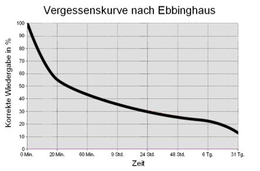
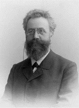
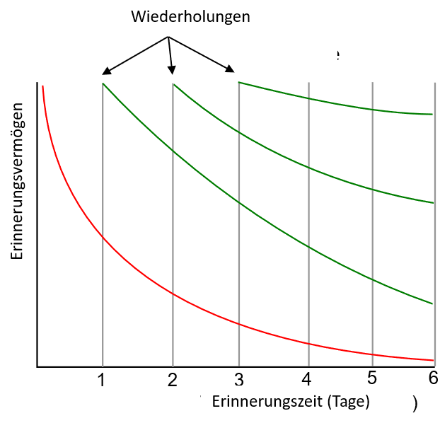

# Software Engineering komplexer Systeme
## Komplexität

Prof. Dr.-Ing. Andreas Heil

 Dieses Werk ist lizensiert unter einer Creative Commons Namensnennung 4.0 International Lizenz.

v.1.1.0

---

# SEKS

Die Veranstaltung im Curriculum, Voraussetzung und Ziele bzw.
Kompetenzen

* Vorlesungsorganisation, Arbeitsform und Online
* Personen und Ressourcen
* Fragen

---

# Die Veranstaltung im Curriculum

## SEB SPO4

### H3 262060 Labor für Softwareentwicklung 1

* H3.2 262051 Developer-Tools des SE
* H3.1 262058 Datenbanken 1
* **H3.4 262061 Software Engineering komplexer Systeme**
* H3.3 262063 Projektmanagement und Tools des SW Engineering

--- 

# Voraussetzungen (SEB)

* G5.1 262005 Grundlagen des Software Engineering 1✔
* G5.2 262006 Grundlagen des Software Engineering 2✔

---

# Ziele und Kompetenzen 

* Ausgewählte und weiterführende Themen aus dem Software Engineering **kennen lernen** 
* Methoden bei größeren und komplexen Software-Projekten **kennen und anwenden lernen**
* **Erarbeiten und Vorstellen** eines komplexen Themas aus dem Gebiet der Software-Entwicklung

---

# Personen und Ressourcen 

## Prof. Dr.-Ing. Andreas Heil 
Haben Sie Fragen? 
Über mich?  Werdegang, Hintergrund? Programmiererfahrung? XBOX Gamertag?
Quicklink: [https://prof.aheil.de](https://prof.aheil.de)

 

## Vorlesung SEKS
Kursseite und Lernmaterialien: [https://www.hs-heilbronn.de/seks](https://www.hs-heilbronn.de/seks)
ILIAS für Abgaben: [https://ilias.hs-heilbronn.de/goto.php?target=crs_360741](https://ilias.hs-heilbronn.de/goto.php?target=crs_360741) 

---

# Prüfung 

* LKBK = lehrveranstaltungsbegleitend durch Kombinierte Prüfung mit Klausur als abschließender Prüfung
* 90 = 90-minütige schriftliche Prüfung (EvaExam)
* Klausur zählt 50% der Endnote
* Für das Bestehen des Kurses sind 40% der Klausurpunkte notwendig
* 25% Multiple-Choice, 75% offene Fragen
* **Zugelassene Hilfsmittel: doppelseitig beschriftetes DIN A4 Blatt (handschriftlich oder gedruckt)** 
* Ja, man kann sich durch die Klausur in der Note verschlechtern

---

# Übungsaufgaben 

* Es gibt mehrere Übungsaufgaben, die Sie in Gruppen (2-3 Student*innen)bearbeiten
* Abgabe via ILIAS
* Zu späte Abgaben werden mit 0 Punkten bewertet 
* Abgaben per Mail werden mit 0 Punkten bewertet

---

# Kurzreferat 

* Sie erarbeiten in Ihrer Gruppe (2-3 Student*innen) ein Thema 
* Sie stellen das Thema vor
* Abgabe: In den letzten Vorlesungsversuchen, genauer Termin wird nach der Klausurphase im Mai bekannt gegeben

---

# FAQ

* Ich habe im Referat und den Hausaufgaben je eine 1,0, bin in der Klausur durchgefallen. Rechnerisch komme ich auf eine 3,1. habe ich den Kurs bestanden.
    * Nein, zum Bestehen ist nach der Prüfungsordnung in der Klausur mind. eine 4,0 erforderlich. 
* Ich habe die Klausur bestanden, bestehe ich den Kurs auf jeden Fall, auch wenn ich die anderen Aufgaben nicht bearbeite?
    * Nope, Angenommen Sie haben in der Klausur eine 4,0 und erhalten für die Hausaufgaben eine 4,0 und halten kein Kurzreferat, was mit einer 4,7 bewertet würde. Damit erhalten Sie die Endnote 4,1 und sind durchgefallen. 

---

# Veranstaltung WiSe 21

* Veranstaltung 
    * Montags 14:00 bis 15:30 
    * Raum A212        
    * Sollte aufgrund geltender Regelungen ein Wechsel in den Online-Betrieb erforderlich sein:
        * BBB: https://bbb.it.hs-heilbronn.de/b/and-pxc-zoq-mxc
* Sprechstunde WisSe 21
    * Dienstags 09:45 bis 11:15 Uhr         
    * Derzeit noch online via BBB, https://prof.aheil.de/bbb 
    * Bitte nutzen Sie die Buchungsfunktion in ILIAS 

---

# Termine 

| Datum | Thema |
| --- | --- | 
| 27.09. | Einführungsveranstaltung |
| 04.10. | Komplexität |
| 11.10. | Projektmanagement im Software Engineering - Grundlagen |
| 18.10. | Vorgehensmodelle: Scrum und (besser nicht) Wasserfall  |
| 25.10. | Metriken |
| 01.11. | Vorlesungsfrei (Allerheiligen) |
| 08.11. | Qualitätssicherung |
| 15.11.| C4 Modell | 
| 22.11. | Software Architekturen |
| 29.11.| Vorlesungsfrei (Blockwoche) |
| 06.12.| Schätzen und Schätztechniken ||
| 13.12.| Gastvortrag (N.N.)|
| 20.12.| Gastvortrag (N.N) ||
| 16.01.| Studentische Vorträge |
| 23.01.| Studentische Vorträge | 

---

<!-- footer: By Unknown author - http://www.unipublic.unizh.ch/magazin/gesellschaft/2005/1440/ebbinghaus2.jpg, Public Domain, https://commons.wikimedia.org/w/index.php?curid=4039544 -->

# Vergessenskurve nach Ebbinghaus

  
  

---

<!-- footer: "" -->

  

# Vergessenskurve nach Ebbinghaus

* Innerhalb einer Woche die Notizen für mind. 30 Minuten täglich wiederholen 
* Danach jede Woche die Notizen für 30 Minuten wöchentlich wiederholen
Es macht einen merkbaren Unterschied, wie Sie sich erinnern (auch beim Lernen auf die Klausur)

<!-- -->

---

# Einstieg zum "warm werden"

* Notieren Sie bitte welche Themen Sie aus SE 1 und SE 2 interessiert haben, welche Themen Sie gerne vertiefen würden oder welche Themen Sie nicht verstanden haben... 
* Timebox: 5 min
* Gemeinsames sammeln an der Tafel
