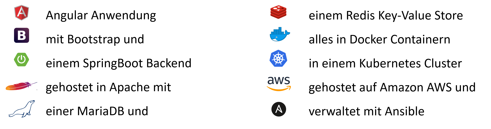

# Software Engineering komplexer Systeme
## Komplexität

Prof. Dr.-Ing. Andreas Heil

 Dieses Werk ist lizensiert unter einer Creative Commons Namensnennung 4.0 International Lizenz.

v.1.0.1

---

# Teil 1: Komplexität

---

# Lernziele dieser Einheit

* Den Unterschied zwischen kompliziert und komplex **kennen lernen**

* **Verstehen**, was ein System ausmacht und welche unterschiedlichen Arten von Systemen es gibt

---

# Was ist ein komplexes System? (1)

> Komplexe Systeme enthalten eine **Vielzahl von Komponenten**, die zusammenwirken und damit eine Funktionseinheit bilden. Dabei selbstorganisiert sich die »emergente« Funktion des Systems **ohne jede übergeordnete Kontrollinstanz**. - Forschungsperspektiven der Max-Planck-Gesellschaft, 2010, S. 56ff. 

---

# Was ist ein komplexes System? (2)

> Ein komplexes System trägt die **Anlage zur chaotischen Entartung** in sich. - Unbekannt

> Komplexe Systeme sind Systeme, welche sich der Vereinfachung verwehren und vielschichtig bleiben. -
Wikipedia[^1]

---

# Ein Beispiel 

Wenn Sie heute eine Single Page Application bestellen, kann es schnell passieren, dass Sie so etwas erhalten: 

---

# Definitorisches - Übersicht

* Software Engineering
    * Bekannt aus Grundlagen Software Engineering 1 + 2
    Sommerville [1], Balzert [2,3]
* komplexer
    * Unterschied zwischen komplex und kompliziert?
* Systeme
    * System?

---

# Definitorisches - Software Engineering

* Software Engineering ist eine empirische Disziplin
    * Beruht auf Beobachtungen und Erfahrungen 
* Weiterentwicklung des Software Engineerings 
    * Ist durch die Praxis getrieben
* Achtung!
    * Es gibt in den meisten Fällen kein »Richtig« oder »Falsch«
	Was in dem eine Projekt oder Team funktioniert, kann in einem anderen Projekt oder einem anderen Team Probleme verursachen 
* Wahl der Methode, Architektur, Projektmanagement
    * Immer abhängig vom Kontext

---

# Definitorisches: Einfach - Kompliziert - Komplex

---

# Definitorisches: System

Ein System ist eine **Gesamtheit von Komponenten**, die so aufeinander bezogen oder miteinander verbunden sind und in einer Weise **interagieren**, dass sie als eine **aufgaben-, sinn-, oder zweckgebundene Einheit** angesehen werden können.  

---

# Zusammenfassung

* Unterschied zwischen kompliziert und komplex
* Was ein System ausmacht und welche Arten von Systemen es gibt

---

# Teil 2: Entstehung von Komplexität 

---

# Wie entstehen komplexe Systeme?

---

# Lernziele dieser Einheit

* Sie **verstehen** welche Ursachen es für organisatorische als auch technische Komplexität geben kann
* Sie **lernen kennen** welche Maßnahmen es gibt, um diesen Arten von Komplexität entgegen zu wirken

---

# Merkmale organisatorischer Komplexität 

* Anzahl Team Mitglieder
* Beziehungen zwischen Teammitgliedern
* Anzahl der Teams
* Interne vs. externe Teammitglieder
* Geographische Verteilung der Teammitglieder
* Interkulturelle Unterschiede

---

# Merkmale organisatorischer Komplexität (Forts.)

* Reputation des Projekts in der Organisation
* Anzahl Zulieferer und externer Firmen
* Kundenprojekt vs. Standard Software
* Beziehung zum Kunden
* Anzahl der Stakeholder
* Beziehung zu anderen Projekten

---

# Merkmale technischer Komplexität 

* Art, Anzahl und Eindeutigkeit der Anforderungen
* Anzahl Komponenten und Schnittstellen
* Benutzer Interface
* Menge und Art der Daten
* Code Basis (Lines of Code)

---

# Merkmale technischer Komplexität (Forts.)

* Brownfield vs. Greenfield Projekt
* Legacy Code
* Bekannte vs. neue Technologien
* Anzahl Programmiersprachen
* Verteilte Systeme
* Parallelität im Code
* Security

---

# Anmerkung zu organisatorischen Systemen

In organisatorischen Systemen existieren **offizielle Beziehungen**
* Projektmanager gibt Inhalte dem Team vor
* Teamleiter ist disziplinarisch Vorgesetzter
* Entwicklungsleiter ist fachlicher Entscheidungsträger
* Projektleiter gibt Termine vor
* Entwickler entscheiden über Code

---

# Anmerkung zu organisatorischen Systemen (Forts.)

Und es gibt **inoffizielle Beziehungen**

* Teamleiter ist mit einem Teammitglied im gleichen Fußballverein
* Entwicklungsleiter „kann nicht“ mit Entwickler A
* Entwickler B ist bester Freund von Entwickler C
* Externer Berater ist Bruder des Schwagers von Entwickler D

---

# Wie also Komplexität in den Griff bekommen?

**Organisatorische** Komplexität reduzieren
* Projektmanagement
* Vorgehensmodelle
* Schätzen und Schätztechniken
* Anforderungsanalyse

**Technische** Komplexität reduzieren
* Software Architekturen
* Code Metriken
* Testen
* Clean Code

---

# Referenzen

[^1]:  https://de.wikipedia.org/wiki/Komplexes_System

[1] I. Sommerville, Software Engineering, Pearson, 2018
[2] I. Sommerville, Modernes Software-Engineering: Entwurf und Entwicklung von Softwareprodukten, Pearson, 2020
[3] H. Balzert, Lehrbuch der Softwaretechnik: Entwurf, Implementierung, Installation und Betrieb, Spektrum Akademischer Verlag, 2011

