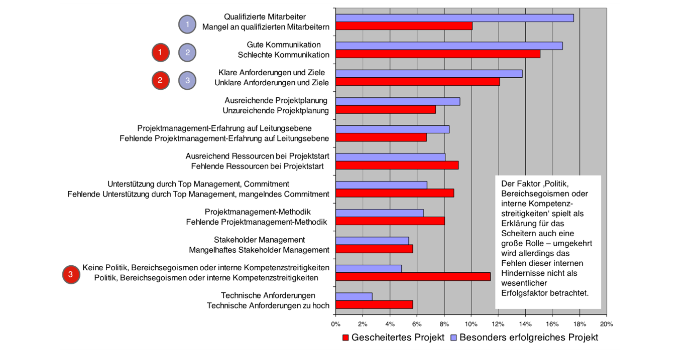
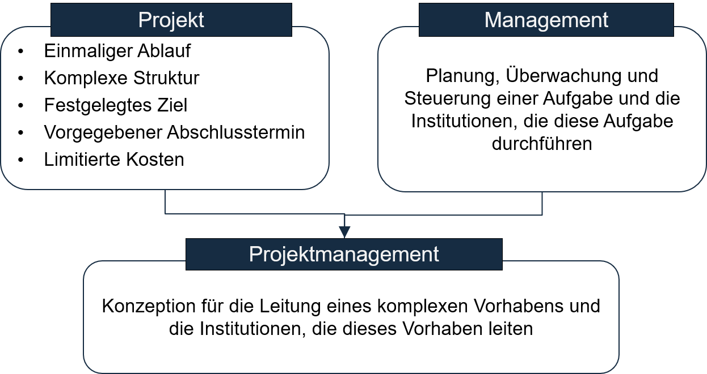
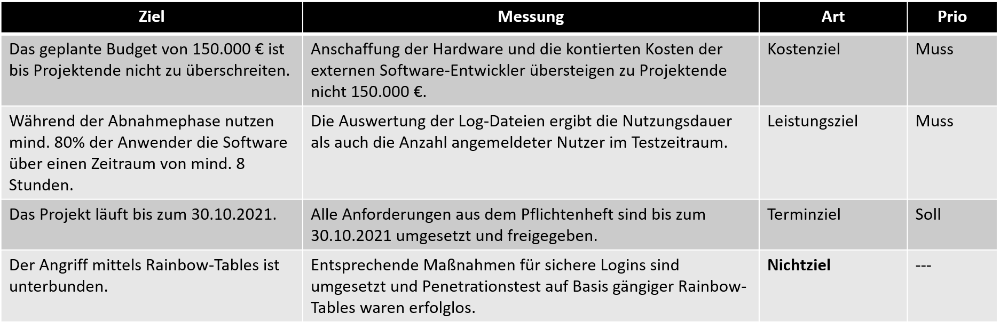
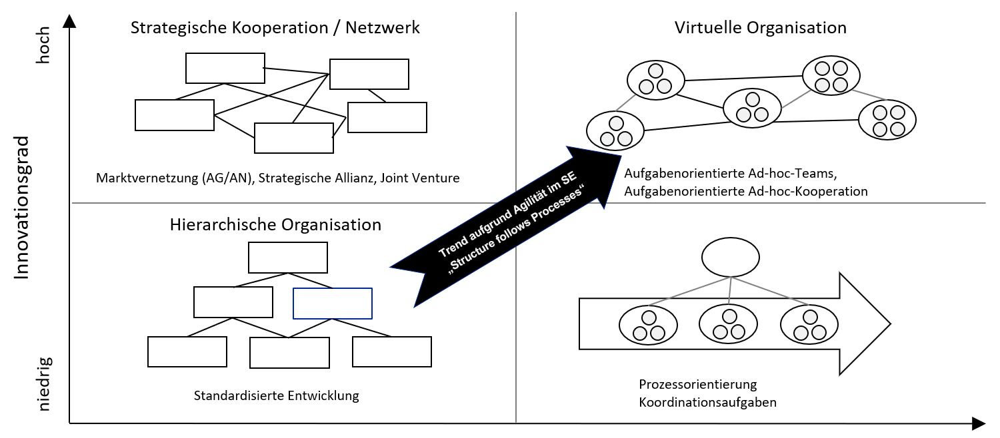
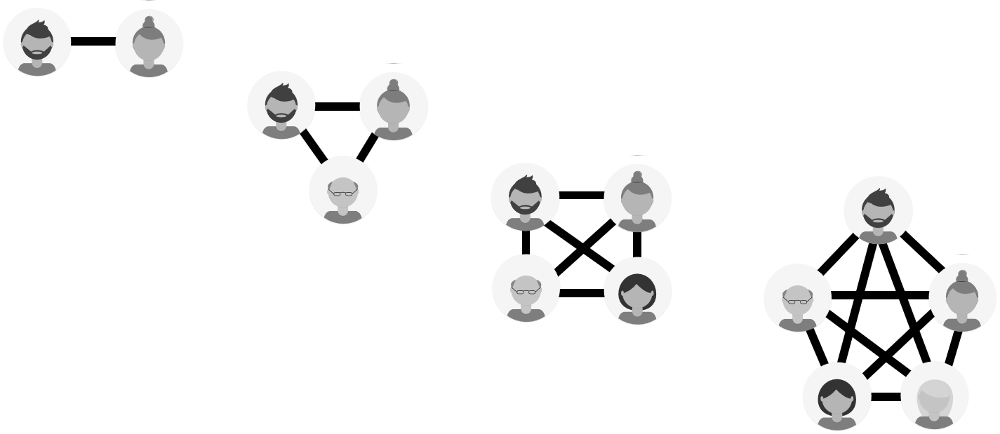
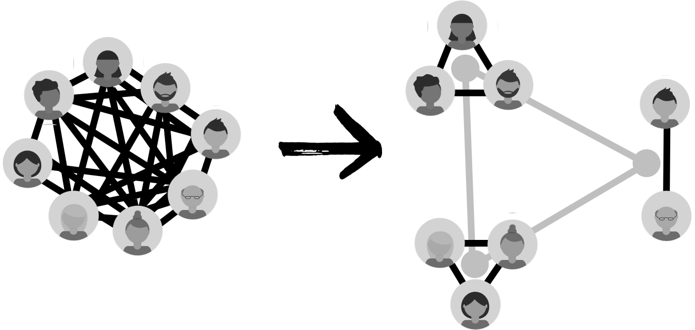
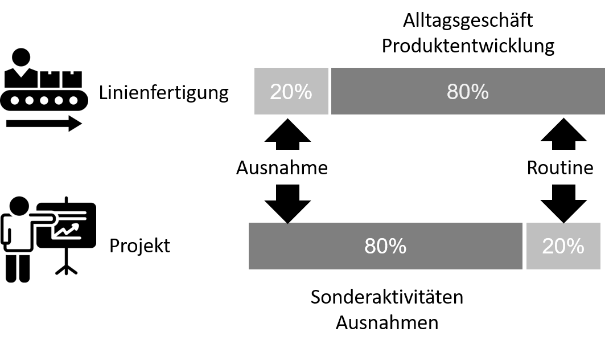
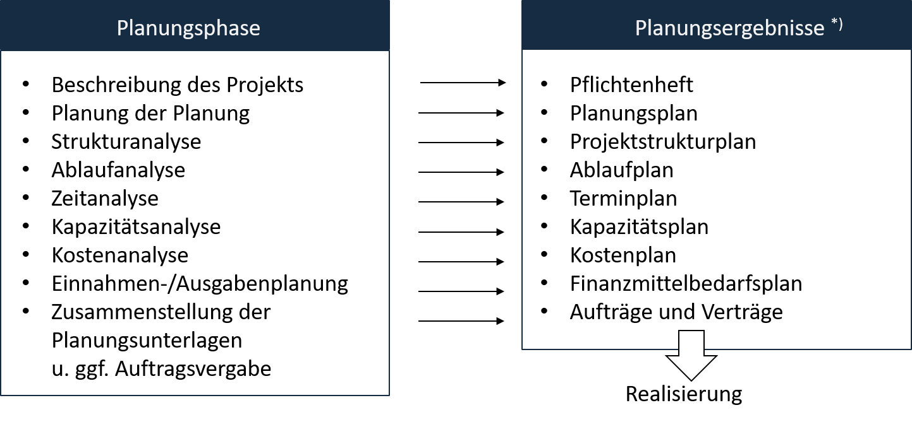
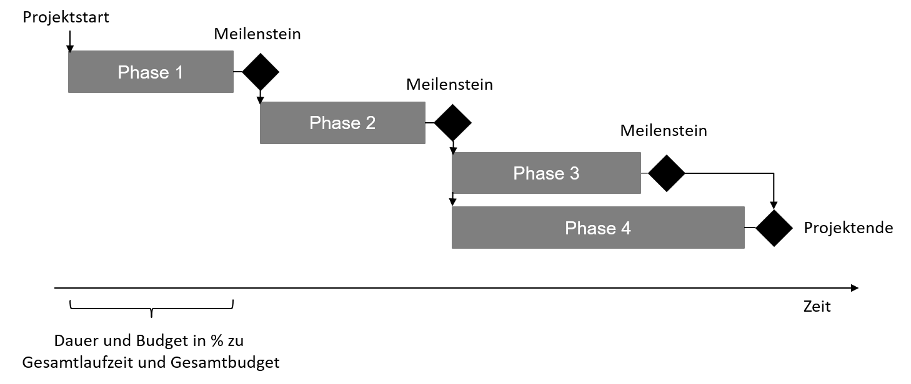

# Software Engineering komplexer Systeme
## Projektmanagement - Grundlagen

Prof. Dr.-Ing. Andreas Heil

 Dieses Werk ist lizensiert unter einer Creative Commons Namensnennung 4.0 International Lizenz.

v.1.0.0

---

# Inhalt

* Einführung
* Projektziele
* Projektkommunikation u. -strukturen
* Praxisbeispiel

---

# Einführung

---

# Was ist eigentlich ein Projekt?

* DIN 6990 / 69901
    > Ein Vorhaben, das im wesentlichen durch Einmaligkeit der Bedingungen in ihrer Gesamtheit gekennzeichnet ist…

* Diese Einmaligkeit bezieht DIN 69901 auf
    * die Zielvorgabe,
    * die zeitliche, finanzielle, personelle Begrenzung,
    * die Organisationsform,
*   die Abgrenzung gegenüber anderen Vorhaben

* Project Management Institute, PM Body of Knowledge
    * Eine vorübergehende Anstrengung zur Erzeugung eines einmaligen Produktes oder Dienstes…

---

# In der Praxis

* Projekte sind meist durch **Rahmenbedingungen** definiert
* Projekte sind Vorhaben, die mit einem **beschränkten Aufwand** in einer **vorgegebenen Zeit** ein **eindeutiges Ziel** erreichen sollen
* Der **Lösungsweg**, um das Ziel eines Projektes zu erreichen ist meist **nicht bekannt**
* Ein Projekt besteht aus einer **Vielzahl von Einzelaufgaben** und ist dadurch komplex
* Ein Projekt umfasst **neuartige Aufgaben und Inhalte** 
* Ein Projekt hat ein **höheres Risiko** als eine Routinetätigkeit

---

# Was eignet sich für Projekte?

* Neue Produkte
* Produktentwicklung
* Erschließung neuer Vertriebswege 
* Innovationen
* Aufgaben, die nicht von einer Abteilung alleine gelöst werden können
* Nichtalltägliche Vorhaben

---

# Was eignet sich nicht für Projekte?

* Grundlagenforschung 
* Fließbandarbeit (auch in der SW-Entwicklung) 
* Serviceleistungen
* Einzeltätigkeiten

---

# Welche Arten von IT-Projekten gibt es?

* Es existieren unterschiedliche Arten von Software- bzw. IT-Projekten
    * Entwicklung von Individual-Software
    * Entwicklung von Software-Produkten / Systemen
    * Einführung von Software-Produkten / Systemen
    * Betrieb von Software-/IT-Systemen
    * Rückbau bzw. Außerbetriebnahme von IT-Systemen
    * IT-Beratung 
    * Angebotserstellung für Software-/IT-Projekte (kann auch ein Projekt sein)	

---

# Warum scheitern Projekte?

 [1]

---

# Definitorische Grundlagen

---

# Bestandteile des funktionalen Projektmanagements 

* Qualitätsmanagement
* Projektplanung
* Projekt-Controlling
* Projektabwicklung/-realisierung
* Projektdefinition
* Projektdokumentation
* Projektkontrolle

Viele Aufgaben und Artefakte, die in erster Linie nichts mit „Programmieren“ zu tun haben!

Das klingt alles sehr kompliziert, und dass, obwohl wir Komplexität reduzieren möchten?

---

# Klassifizierung von Projekten 

* Zielsetzung
    * Dringlichkeit, Wichtigkeit, Motivation
* Qualitätsanspruch
    * Leistung, Funktion
* Größe
    * Investitionsvolumen, physischer Umfang
* Komplexitätsgrad
    * Fachdisziplin, Beteiligte

---

# Klassifizierung von Projekten (2)

* Innovationsgrad
    * Pionier, Routine
* Ressourcenbedarf
    * Kapital, Material, Personal
* Realisierungsrisiko
    * Sicherheit, Kosten, Folgen

---

# Projektziele

---

# Zielarten

---

# Nichtziele

Sogenannte **Nichtziele** dienen der klaren Abgrenzung der Beauftragung  im Projekt

---

# Magisches Dreieck

* Verschiedene Zielgrößen
    * Umfang Features / Qualität 
    * Zeit
    * Budget
* Alle Zielgrößen stehen miteinander in Konkurrenz
* Zielgrößen können oder müssen angepasst werden
    * Aber: Anpassen von Zielgrößen führt zum Neuplanen eines Projekts

---

# Plan vs. Planung

> The whole when finished is only the successful presentation of a theme. In battles however the other fellow interferes all the time and keeps up-setting things, and the best generals are those who arrive at the results of planning without being tied to plans. - Winston S. Churchill, “A Roving Commission: My Early Life”, 1941 

---

# »Smarte« Ziele formulieren

* Saubere Definition des Ziels ist Voraussetzung für das Gelingen eines Projekts

* Formulierung
    * Vollständig
    * Eindeutig
    * Positiv
    * Ergebnisorientiert
    * Lösungsneutral
    * In Zielsprache „… ist erreicht“

---

# S.M.A.R.T

Hilfestellung: S M A R T
* **S**pezifisch
* **M**essbar
* **A**ttraktiv (akzeptiert, abgestimmt)
* **R**ealistisch
* **T**erminiert

---

# Beispiele: Ziele nach SMART formulieren

---

# Projektkommunikation u. -strukturen

---

# Beispielhafte Projektorganisationsformen

---

# Komplexität durch Kommunikation (1)

---

# Komplexität durch Kommunikation (2)

* Abstimmungen für
    * Anforderungen
    * Schnittstellen
    * Fachliche Inhalte
    * Technische Anforderungen
    * Termine
    * ...

---

# Komplexität durch Kommunikation (3)

Bei wachsender Projektgröße wächst die Komplexität aufgrund von zusätzlichen Abstimmungen

Mathematisch: 
$$
𝑓(𝑛)=\frac{(n\cdot(𝑛−1))}{2}
$$

---

# Verringerungen der Komplexität

---

# Teamgrößen

Optimale Teamgröße 
* 5 +/- 2 als Richtwert
* 7 bis 9? 
* Es kommt darauf an 

»Two Pizza Rule«
* Jeff Bezos, Gründer von Amazon 
* Maximale Teamgröße so wählen, dass das Team mit zwei Pizzas*) satt wird

---

# Aufteilung von Projektaufgaben

---

# Projekt oder Linienfertigung?

Am Beispiel Tesla
* 2018 benötigten nur 14 Prozent der hergestellten Fahrzeuge keine Nachbearbeitung
* Die Model-3-Fertigung entspricht daher eher einem Projekt als einer Linienfertigung

Gemäß dem bisher Gelernten wäre dies sogar stimmig, werden z.B. die Kriterien für Projekte betrachtet

---

# Planen von Projekten

* Projektplanung scheint zunächst als ein großer Overhead, ermöglicht jedoch
    * eine höhere Erfolgswahrscheinlichkeit die Projektziele zu erreichen
    * das Projektrisiko zu vermindern
    * kritische Arbeitspakete zu ermitteln
    * die Projektressourcen zielgerichtet einzusetzen
    * eine sichere Aussage zum Projektablauf zu geben
    * die Koordination der Projektbeteiligten sicherzustellen
    * notwendige Ressourcen rechtzeitig zu beschaffen
    * eine effiziente Steuerung des Projektes 

---

# Einige Artefakte der Projektplanung

*) Einige dieser Artefakte werden z.B. im Labor für Software-Projekte und Project Skills erwartet

---
# Wie läuft eigentlich eine Projektplanung ab?

---

# Projektablaufplan

* Der **Projektablaufplan** ist die erste Planung, um die Komplexität eines Projekts zu reduzieren
    * Besteht aus einzelnen Projektabschnitten und Meilensteine
    * Ein **Projektabschnitt** ist ein zeitlicher Abschnitt die inhaltlich voneinander getrennt sind
    * Ein **Meilenstein** ist ein Ergebnis im Projekt 

---

# Projektablaufplan: Beispiel GANTT

---

# Praxisbeispiel

Verpflichtend: Bei Aufwänden > 5 Personentage

* Projektbeschreibung
* Definiertes Projektteam, insb. Projektleitung
* Freigabeprozess bzgl. des Budgets und der Personen  
* Regelmäßige Reviews, Controlling
* Steuerung bei Budgetproblemen
* Lessons Learned
* Abschlussbericht

---

# Bildnachweise 

[1]  Projektmanagement Studie 2008, GPM Deutsche Gesellschaft für Projektmanagement e.V. und PA Consulting Group 
