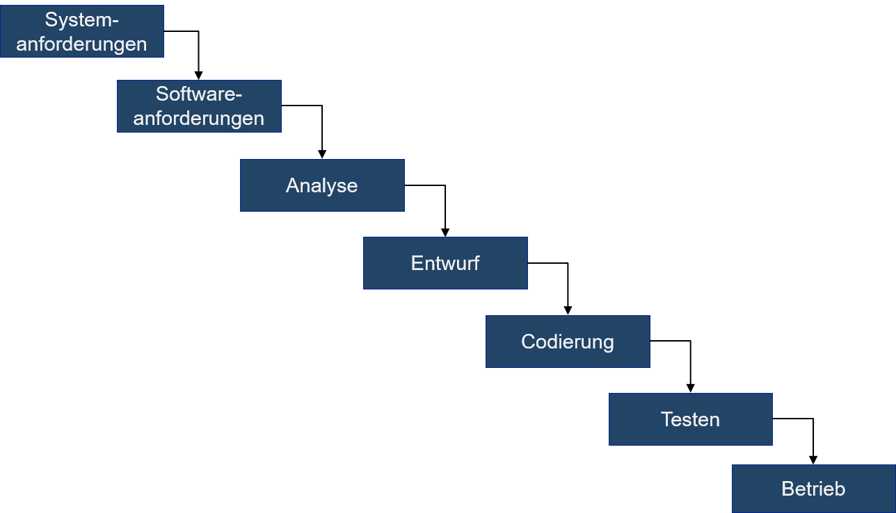

# Software Engineering komplexer Systeme
## Vorgehensmodelle - Wasserfall

Prof. Dr.-Ing. Andreas Heil

 Dieses Werk ist lizensiert unter einer Creative Commons Namensnennung 4.0 International Lizenz.

v.1.0.1

---

# Inhalt

* Warum Vorgehensmodelle 
* Wasserfallmodell

---

# Warum brauchen wir Vorgehensmodelle?

* (Professionelle) Software-Entwicklung ist keine reine Programmiertätigkeit 
* Erstellung von (professioneller) Software ist Ingenieurtätigkeit
* Kunden / Auftraggeber (auch intern) zahlen Geld für ein Produkt
* Bei der Erstellung sind (sehr) viele Personen beteiligt 
* Es gibt Termin- und Zeitpläne (die meist utopisch sind)
* Es gibt mehr Wünsche als umgesetzt werden können (sollten)
* Software-Entwicklung wird (unweigerlich) zu einem Prozess

---

# Probleme bei der Entwicklung komplexer Software-Systeme

- Systeme werden immer komplexer 
- Tools entwickeln sich immer schneller
- Entwicklung wird immer komplizierter 
- Wartung wird immer aufwändiger 
- Schätzungen werden immer schwerer
- Es wird immer schwerer den Überblick zu behalten

---

# Anforderungen an die Software-Entwicklung

- Zeiträume werden immer kürzer
- Anforderungen wachsen
- Anforderung an Qualität steigt 
- Sicherheitsanforderungen steigen 
- Betriebs- und Wartungskosten sollen sinken

**✅ Ein Plan muss her!**

---

# Was ist ein Vorgehensmodell?

Das meint Wikipedia[^1]:

> Ein Vorgehensmodell zur Softwareentwicklung ist ein für die Softwareentwicklung angepasstes Vorgehensmodell bei der professionellen („ingenieursmäßigen“) Anwendungsentwicklung. Es dient dazu, die Softwareentwicklung übersichtlicher zu gestalten und in der Komplexität beherrschbar zu machen.

[^1]: https://de.wikipedia.org/wiki/Vorgehensmodell_zur_Softwareentwicklung

---

# Vorgehensmodell

* Vorgehensmodelle beschreiben einen allgemeinen Rahmen für den organisatorischen Prozess der Software-Entwicklung 

* Vorgehensmodelle bestehen aus:
    * Durchzuführende Aktivitäten
    * Reihenfolge der Aktivitäten und Phasen
    * Definition der Teilprodukte und Ergebnisse 
    * Fertigstellungskriterien
    * Verantwortlichkeiten und Kompetenzen 
    * Eventuell Mitarbeiterqualifikationen
    * Anzuwendende Standards, Richtlinien, Methoden und Werkzeuge

---

# Ziele von Vorgehensmodellen

* Kontrolle von Zeit, Budget und Qualität 
* Planbarkeit durch strukturierte und standardisierte Vorgehensweise 
* Optimieren des Entwicklungsprozesses 
* Vermeidung von Leerlaufzeiten und unnötigen Arbeiten
* Minimierung von Projektrisiken
* Gewährleistung der Qualität
* Verbesserung der Kommunikation innerhalb und außerhalb des Projekts
* Automatisierung durch Werkzeuge

---

# Wasserfallmodell

---

# Wasserfall

---

# Beispiele für Wasserfall Probleme

* Beispiel 
    * In den Tests wird das erste Mal ersichtlich, dass eine Anforderung falsch verstanden wurde...
* Konsequenz
    * Kosten und Entwicklungszeit verdoppeln sich...
* Weiteres Problem
    * Keine Steuerung von Risikofaktoren

---

# Gravierende Rückschritte durch späte Probleme

---

# Einge Geschichte unglücklicher Missverständnisse

* Winston W. Royce (1929-1995), Informatiker und Direktor bei Lockheed Software Technology Center
* Paper *Managing the Development of Large Software Systems*, 1970
Beschreibt den fehlerbehafteten und risikoreichen Prozess der Software-Entwicklung in den 1960ern  
> I believe in this concept, but the implementation described above is risky and invites failure

---

# Wasserfall Ursprung

* Der Prozess wurde als solcher nie von Royce propagiert  
* Erstmals genannt im Paper von von Bell & Thayer, *Software requirements: Are they really a problem?*, 1976

> The same top-down approach to a series of requirements statements is explained, without the specialized military jargon, in an excellent paper by Royce ;he introduced the concept of the “waterfall” of development activities. In this approach software is developed in the disciplined sequence of activities shown in Figure I.

* Aber 1986 im Department of Defense Standard 2167A (DOD-STD-2167A) als quasi  Entwicklungsstandard für externe Entwicklungspartner eingeführt

---

# Missverständnisse (1)

- In den Ausführungen von Royce finden sich Konzepte, die sich heute in Agilen Methoden und DevOps-Ansätzen wiederfinden.

- DevOps: Entwicklung und Betrieb in einem Team 
> There is first an analysis step, followed second by a coding step as depicted in Figure 1. This sort 	of very simple implementation concept is in fact all that is required if the effort is sufficiently 	small and if the final product is to be operated by those who built it

- Scrum: Iterative Entwicklung („Do it twice“)
> If the computer program in question is being developed for the first time, arrange matters so that the version finally delivered to the customer for operational deployment is actually the second version…

---

# Missverständnisse (2)

- Scrum: Involve the customer
> …also the kind of development effort for which most customers are happy to pay, since both 	steps [Anm. Analyse u. Codierung] involve genuinely creative work which directly contributes to the usefulness of the final product.

> It is important to involve the customer in a formal way so that he has committed himself at 	earlier points before final delivery.

> …points following requirements definition where the insight, judgment, and commitment of the 	customer carl bolster the development effort.

<!-- 
# Plan, Control and Monitor Testing
> TBD
-->

---

# Empfohlene Reviews durch Royce

- Royce beschreibt in seinem Paper drei Reviews, die sich im »Wasserfallmodell« jedoch nicht finden

* **Preliminary Software Review** 	
    * Zeitpunkt: Nach vorläufigem Software Design 

* **Critical Software Review**
    * Zeitpunkt: Nach dem Programm Design 

* **Final Software Acceptance Review**
    * Zeitpunkt: Nach dem Testen 

---

# Zusamenfassung 

* Wasserfall war ursprünglich kein empfohlenes Vorgehensmodell, sondern beschrieb den unzureichenden Stand der Technik in den 1960ern
* Durch eine Verkettung vin unglücklichen Ereignissen etablierte sich dieses Modell als de-facto Standard in der Software-Entwicklung 
* Im originalen Paper von Royce finden sich bereits viele Empfehlungen und Beobachtungen die erst ab den 2000ern in agilen Vorgehensmodellen und der DevOps-Bewegung Anklang fanden
