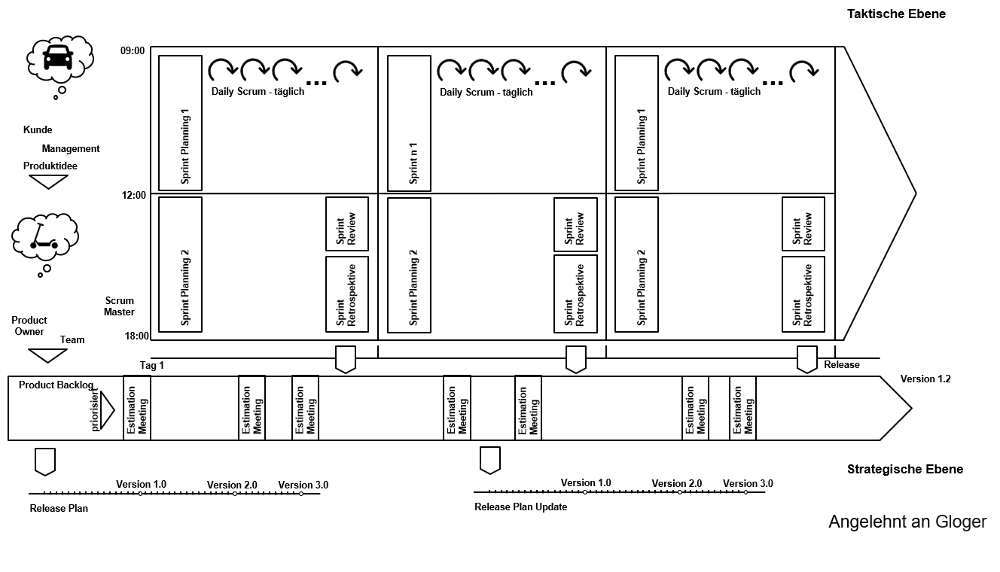
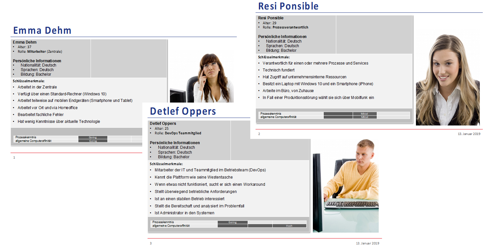
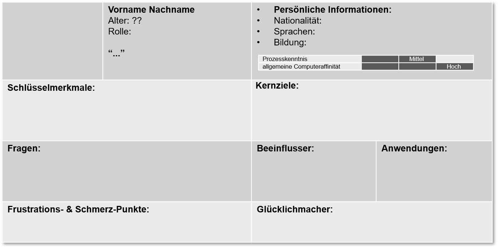

# Software Engineering komplexer Systeme
## Vorgehensmodelle - Scrum

Prof. Dr.-Ing. Andreas Heil

 Dieses Werk ist lizensiert unter einer Creative Commons Namensnennung 4.0 International Lizenz.

v.1.0.0

---

# Realitätscheck

In Wirklichkeit...
* Sind Anforderungen schwer abzuschätzen 
* Ändern sich Anforderungen fortwährend
* Ändern sich Anforderungen (zu) spät im Projekt 
* Ist die Kommunikation mit dem Auftraggeber bzw. Kunden schwer  

---

# The New New Product Development Game 

The New New Product Development Game, Hirotaka Takeuchi and Ikujiro Nonaka, Harvard Business Review, 1986[^1]

* Warum wurde die Kamera  ein Erfolg?

[1]

---

# Ursprung von Scrum

* Scrum Begriff das erste Mal eingeführt 

* Entwicklung der Canon AE-1 (Canon, 1976) 
    * Cross-Functional Teams
    * Self-Organizing Teams
    * Autonome Teams

--- 

# Scrum ist kein Acronym

[2]

---

# Agiles Manifest

**Individuen und Interaktionen** mehr als Prozesse und Werkzeuge  
**Funktionierende Software** mehr als umfassende Dokumentation  
**Zusammenarbeit mit dem Kunden** mehr als Vertragsverhandlung  
**Reagieren auf Veränderung** mehr als das Befolgen eines Plans

> Das heißt, obwohl wir die Werte auf der rechten Seite wichtig finden, schätzen wir die Werte auf der linken Seite höher ein.[^2]

---

# 12 Prinzipien (1)

1. Unsere höchste Priorität ist es, den Kunden durch **frühe und kontinuierliche Auslieferung** wertvoller Software zufrieden zu stellen.

2. Heise Anforderungsänderungen selbst spät in der Entwicklung willkommen. Agile Prozesse nutzen **Veränderungen zum Wettbewerbsvorteil des Kunden**.
3. Liefere **funktionierende Software regelmäßig** innerhalb weniger Wochen oder Monate und bevorzuge dabei die kürzere Zeitspanne.

4. **Fachexperten und Entwickler** müssen während des Projektes **täglich zusammenarbeiten**.

---

# 12 Prinzipien (2)

5. Errichte Projekte rund um **motivierte Individuen**. Gib ihnen das Umfeld und die Unterstützung, die sie benötigen und **vertraue** darauf, dass sie die Aufgabe erledigen.

6. Die effizienteste und effektivste Methode, Informationen an und innerhalb eines Entwicklungsteams zu übermitteln, ist im **Gespräch von Angesicht zu Angesicht**.

7. **Funktionierende Software** ist das wichtigste Fortschrittsmaß.

8. Agile Prozesse fördern nachhaltige Entwicklung. Die Auftraggeber, Entwickler und Benutzer sollten ein **gleichmäßiges Tempo** auf **unbegrenzte Zeit** halten können.

---

# 12 Prinzipien (3)

9. Ständiges Augenmerk auf **technische Exzellenz** und gutes Design fördert Agilität.

10. **Einfachheit** - die Kunst, die Menge nicht getaner Arbeit zu maximieren - ist essenziell. 

11. Die besten Architekturen, Anforderungen und Entwürfe entstehen durch **selbstorganisierte Teams**.

12. In regelmäßigen Abständen **reflektiert** das Team, wie es effektiver werden kann und passt sein Verhalten entsprechend an.

---

# Der Scrum Prozess im Detail

---

# Scrum Rollen 

**Product Owner**
* Verantwortlich für »Business Value«, setzt die Prioritäten für höchstmöglichen ROI 
* Traditionell: Projektmanager, der die Arbeit kontrolliert

**Team**
* Verantwortlich für das kontinuierliches Ausliefern von Arbeitsergebnissen/Teilergebnissen
* Traditionell: Bekommt Arbeitsanweisungen vom Projektmanager

**ScrumMaster**
* Achtet auf das Einhalten des Scrum-Prozesses und hält Störungen vom Team fern
* Traditionell: kein Äquivalent

---

# **Hinweis:** Ein agiler Coach ersetzt keinen ScrumMaster

---

# Berechnung des Release-Termin

---

# Neuberechnung eines Release-Termins 

---

# Anmerkungen zur Release-Planung

* Zusätzliche Anforderungen haben **immer** einen neuen Release-Termin zur Folge 
* Soll der ursprüngliche Termin gehalten werden müssen, sind die am niedrigsten priorisierten Anforderungen zu streichen
* Die Neupriorisierung bzw. Neuordnung von Anforderungen hat keine Auswirkungen auf den Release-Plan

---

# Sprint-Planung - Planning 1

* Sprint-Planung legt Arbeitsvorrat für kommende Iteration (Sprint) fest
* Reihenfolge wird durch Product Owner vorgegeben (Priorisierung) 
* Die Menge der Aufgaben wird durch das Team festgelegt (Pull Prinzip)
    - Erfahrungswerte
    - Empirische Daten
    - Kann auch mal daneben gehen
* Eventuell wir Zeit für Refactoring, Schulungen etc. eingeplant 
* Ergebnis der Sprintplanung ist das Sprint Backlog + Sprint Ziel
* Commitment durch das Team? Seit 2011 kein Bestandteil des Scrum Guide mehr.[^3]

---

# Sprint-Planung - Planning 2

* Es ist Aufgabe des Teams, wie die Funktionalität geliefert werden kann
* Planning 2 ist eine Arbeitssitzung in der das Design, die Spezifikation und die Architektur erarbeitet werden
* Verständnis wie Ziel gemeinsam bewältigt werden kann
* Ergebnis des Planning 2 sind Aufgaben (engl. tasks)
    * Praxistipp: Jeder Task sollte einen maximalen Umfang von maximal 8 Stunden (≈ 1 Personentag) haben

---

# Schätzen 

* Schätzen ist eine der schwersten Aufgaben im Prozess 
* Unterscheidung 
    * Schätzen von Komplexität
    * Schätzen von Aufwand/Dauer
* Keine Korrelation zwischen Aufgabengröße und wie lange ein Entwickler dafür benötigt 
    * Produktivitätsunterschied zwischen Entwicklern bis Faktor 25 
* Schätzen auf Basis von Story Punkten (engl. Story Points)
    * Planning Poker 
    * Magic Estimation 
    * ...
---

# Personas 

* In der agilen Welt werden oftmals »Stories« verwendet
    * Basierend auf Mike Cohen (User Stories Applied, 2004)

* Warum Personas?
    * Stellvertretend für eine spezielle Benutzerrolle (engl. user role)
    * Archetyp eines typischen Anwenders
    * Fiktive Person, die eine Gruppe von Anwender repräsentiert
    * Hilft den Anwender besser zu verstehen

> As a <user role> I <need functionalitiy> so that I get <business value>

---

# Personas (Beispiele)

---

# Personas (Beispiele)

---

# Personas (Muster)

---

# Weiterführende Literatur

**Scrum – Produkte zuverlässig und schnell entwickeln**
Boris Gloger, Hanser Verlag, 5. Auflage, 2016, 
ISBN 978-3-446-44723-3

---

# Bildquellen

[1] Bildquelle: Charles Lanteigne -, CC BY-SA 3.0, https://commons.wikimedia.org/w/index.php?curid=23915880
[2] Catherine Trigg - https://www.flickr.com/photos/cjtrigg/261317878/, CC BY 2.0 

[^1]: https://hbsp.harvard.edu/product/86116-PDF-ENG 
[^2]: http://agilemanifesto.org/
[^3]: https://www.scrum.org/resources/commitment-vs-forecast
